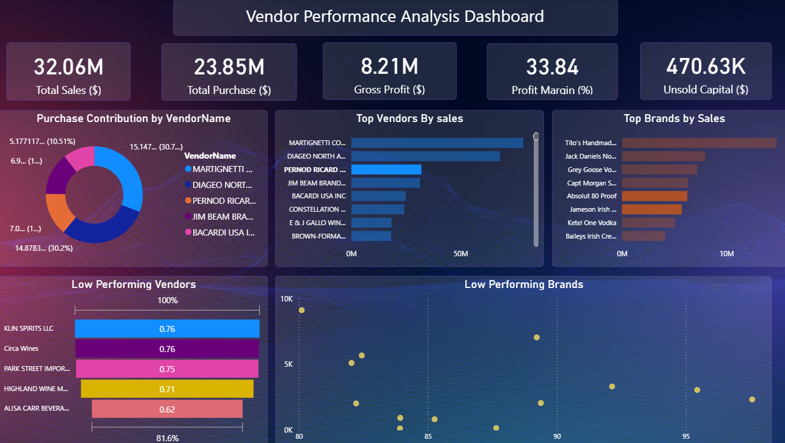

# 📊 Vendor Performance Analysis – Retail Inventory Sales

## 🔍 Project Overview
This project aims to evaluate vendor performance, purchase efficiency, and inventory profitability using over **2 million retail records**. By analyzing vendor contributions to sales, inventory turnover, and unsold stock, the project supports **data-driven purchasing and inventory decisions**.

---

## 🛠️ Tools & Technologies
- **SQL** – Data extraction, ETL pipeline, CTEs, joins, aggregations  
- **Python (Pandas, NumPy)** – Data cleaning, transformation, statistical analysis  
- **Power BI** – Interactive dashboards for business insights and reporting

---

## 📂 Data & Business Context
The dataset contains:
- Purchase transactions  
- Vendor profiles  
- Product inventory and sales data  

**Business Goals:**
- Identify the most and least profitable vendors  
- Detect over-reliance on limited vendors  
- Optimize bulk purchasing decisions  
- Reduce unsold inventory stock  

---

## ⚙️ Key Contributions

- 📌 **Built a robust SQL ETL pipeline** to aggregate and join large tables (2M+ records), improving performance using **CTEs** and filtering logic.
  
- ⚡ **Reduced query runtime** significantly for large-scale joins and summaries.

- 🔍 **Detected over-dependence** on top 10 vendors (65.7% of total purchases), revealing a vendor concentration risk.

- 📦 **Identified $2.71M in unsold inventory** from underperforming vendors and recommended **inventory optimization**.

- 💰 **Quantified 72% cost savings** through analysis of bulk purchase patterns and pricing tiers.

- 📈 **Built interactive Power BI dashboards** to visualize:
  - Vendor sales, profits, and returns
  - Profitability heatmaps
  - Inventory aging and deadstock insights
  - Cost-benefit of bulk buying

---

## 📸 Power BI Dashboard Highlights

## 🧠 Business Impact
  - Provided actionable recommendations to the procurement and supply chain teams.
  -	Enabled data-driven vendor selection and purchase diversification.
  - Helped optimize inventory turnover and reduce deadstock.
  - Empowered stakeholders with real-time visual analytics via Power BI.

  - ## Project Created BY
[@Gajender](https://linkedin.com/in/gajender07)
